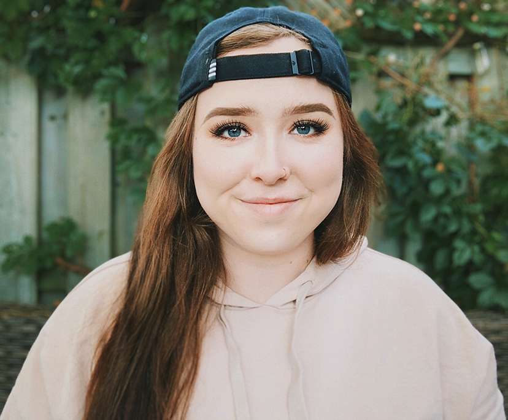

## Welcome to Our Blog

This is our portfolio site. 

### About Us

We're students at Durham College studying Interactive Media Design

### How We Met

Abby and Cassie met at their workplace 2 and a half years ago. They both have similar interests and clicked from the beginning. Unbeknownst to the both of them, they were accepted into the same program and now they use their great chemistry to collaborate on creative projects in and outside of school.

### Cassie

Hey, I’m Cassie! Currently a first year student at Durham College in the Interactive Media program furthering my knowledge in design and technology after obtaining an Advanced Diploma in Graphic Design. Growing up in a small southern Canadian village outside of Toronto I’ve always been fascinated by the power media has of connecting people from all around the world. Exploring this interest I’ve developed a multitude of skills in design, coding, photography, and editing. I hope to push these passions further by welcoming any creative projects that come my way. 

### Abby
Hi I'm Abby! Presently, I am in first year for Interactive Media Design. I acquired a diploma in Animation at Durham College in 2019 and wanted to have a broader depth in the media field. At first wanting to be a nurse, I gravitated towards the arts in the end of my Grade 12 year. Already accepted into a nursing program, I decided to dedicate my life to my love of art, and decided to take a leap of faith and join the Animation program instead. Currently, I do not see a future in any other field. 

### Contact Us

Cassie's Email: cassandra.marchi@dcmail.ca | Abby's Email: abby.sirizzotti@dcmail.ca
